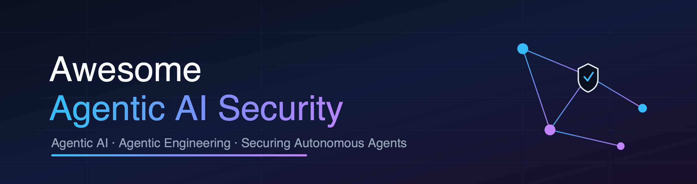

# Awesome Agentic AI Security 

A one-stop, curated list of links, references, papers, books, videos, courses, tools, frameworks, CTFs, and research — everything you need to stay updated on **Agentic AI**, **Agentic Engineering**, and **Agentic AI Security**.

_List inspired by the [awesome](https://github.com/sindresorhus/awesome) list thing. Sister lists: [awesome-genai-security](https://github.com/jassics/awesome-genai-security) · [awesome-aws-security](https://github.com/jassics/awesome-aws-security)._

---

## 🤖 What is Agentic AI?

**Agentic AI** refers to AI systems built around one or more LLM-driven *agents* that don't just answer a prompt — they pursue goals. An agent can **plan** (break a task into sub-goals, reflect, and self-correct), **remember** (short-term context and long-term memory via vector stores), and **act** (call tools, browse the web, run code, and invoke external APIs). Instead of a single request/response, agentic systems run *multi-step, autonomous loops*, and increasingly coordinate as **multi-agent** systems.

## 🧱 What is Agentic Engineering?

**Agentic Engineering** is the discipline of designing, building, and operating these systems *reliably*. It spans the full stack — intent/spec definition, planners and control loops, tool and API integration, memory and state, orchestration frameworks (LangGraph, AutoGen, CrewAI, OpenAI Agents SDK, and more), protocols (MCP, A2A), evaluation and guardrails, observability/tracing, and governance. The guiding principle: **reliability over novelty, evaluation over intuition, architecture over tooling.**

## 🛡️ Why Agentic AI Security Matters

Autonomy changes the threat model. When an agent can *act on the world* — write files, move money, send emails, execute code, chain tools — the blast radius of a single bad decision or a malicious input grows dramatically. Agentic systems inherit every risk of GenAI/LLM apps and add new ones:

- **Indirect & cross-domain prompt injection** — untrusted content in a web page, document, or tool output hijacks the agent's plan.
- **The "lethal trifecta"** — an agent with access to private data + exposure to untrusted content + the ability to exfiltrate is a data-leak waiting to happen.
- **Excessive agency & tool misuse** — over-permissioned agents taking irreversible actions without human approval.
- **Memory poisoning** — persistent state corrupted so future runs behave maliciously.
- **Identity, authority & delegation** — agents acting *as a user* or *as a system account* need scoped authority, audit trails, and a revocation path.
- **Multi-agent risks** — trust between agents, cascading failures, and orchestration-layer attacks.
- **Supply chain** — tools, MCP servers, and dependencies the agent pulls in at runtime.

This list collects the research, standards, tooling, and hands-on practice to help you **understand, model, test, and defend** agentic systems.

---

## Table of Contents

- [Foundations & Key Concepts](#foundations--key-concepts)
- [Papers, Standards & Frameworks](#papers-standards--frameworks)
- [Threats, Risks & Taxonomies](#threats-risks--taxonomies)
- [Agentic Engineering & Agent Frameworks](#agentic-engineering--agent-frameworks)
- [Books](#books)
- [Videos & Talks](#videos--talks)
- [Blogs, Tutorials & Articles](#blogs-tutorials--articles)
- [Online Courses (Paid/Free)](#online-courses-paidfree)
- [Certifications](#certifications)
- [Tools of Trade](#tools-of-trade)
- [Red Teaming & Security Testing for Agents](#red-teaming--security-testing-for-agents)
- [CTFs & Hands-on Labs](#ctfs--hands-on-labs)
- [Attacks, Breaches & Incidents](#attacks-breaches--incidents)
- [Regulatory, Governance & Compliance](#regulatory-governance--compliance)
- [Newsletters & Communities](#newsletters--communities)
- [Contributing](#contributing)
- [Contributors](#contributors)

---

## Foundations & Key Concepts

- [Building Effective Agents](https://www.anthropic.com/research/building-effective-agents) — Anthropic's practical guide to agent patterns (workflows vs. agents).
- [A Practical Guide to Building Agents](https://platform.openai.com/docs/guides/agents) — OpenAI's guidance on agent design and orchestration.
- [Chain-of-Thought Prompting (Wei et al., 2022)](https://arxiv.org/abs/2201.11903) — the reasoning foundation behind planning/decomposition.
- [ReAct: Reasoning + Acting (Yao et al., 2023)](https://arxiv.org/abs/2210.03629) — the reason-and-act loop underpinning tool-using agents.
- [Model Context Protocol (MCP)](https://modelcontextprotocol.io/) — open standard for connecting agents to tools and data.
- [Awesome Agentic Engineering](https://github.com/natnew/Awesome-Agentic-Engineering) — a reference stack for production-grade agentic systems.

## Papers, Standards & Frameworks

- [OWASP GenAI Security Project — Agentic Security Initiative](https://genai.owasp.org/initiatives/#agentic) — threats & mitigations, multi-agent threat modeling, and reference guides.
- [OWASP Top 10 for LLM Applications](https://genai.owasp.org/llm-top-10/) — baseline risks that agentic systems inherit.
- [MITRE ATLAS](https://atlas.mitre.org/) — adversarial threat landscape for AI systems (tactics & techniques).
- [NIST AI Risk Management Framework (AI RMF)](https://www.nist.gov/itl/ai-risk-management-framework) — govern/map/measure/manage for AI risk.
- [ENISA — Considerations on autonomous agents](https://www.enisa.europa.eu/) — security & privacy in autonomous agents.
- [Cloud Security Alliance — AI Safety Initiative](https://cloudsecurityalliance.org/research/artifacts/) — authorization practices for LLM-backed systems.

## Threats, Risks & Taxonomies

- [OWASP Agentic AI — Threats and Mitigations](https://genai.owasp.org/resource/agentic-ai-threats-and-mitigations/) — taxonomy of agentic threats and defenses.
- [Top 10 Agentic AI Security Risks — Key Threats and Mitigation Strategies](https://46710127.fs1.hubspotusercontent-na2.net/hubfs/46710127/Documents/Top%2010%20Agentic%20AI%20Security%20Risks-Key%20Threats%20and%20Mitigation%20Strategies.pdf) — industry threat/mitigation reference (PDF).
- [The lethal trifecta for AI agents](https://simonwillison.net/2025/Jun/16/the-lethal-trifecta/) — private data + untrusted content + exfiltration = data-leak risk.
- [Vulnerable Autonomous Agents Threat Model](https://github.com/jsotiro/ThreatModels) — LLM threats for autonomous agents (diagram/model).

## Agentic Engineering & Agent Frameworks

- [LangGraph](https://langchain-ai.github.io/langgraph/) — graph-based orchestration for stateful, multi-actor agents.
- [Microsoft AutoGen](https://microsoft.github.io/autogen/) — multi-agent conversation framework.
- [CrewAI](https://github.com/crewAIInc/crewAI) — role-based multi-agent orchestration.
- [OpenAI Agents SDK](https://openai.github.io/openai-agents-python/) — lightweight framework for agentic apps.
- [Pydantic AI](https://ai.pydantic.dev/) — type-safe agent framework.
- [LlamaIndex](https://www.llamaindex.ai/) — data framework and agent workflows.

## Books

> _Contributions welcome — books focused on agentic AI, agent design, and AI/LLM security._

- _Add your recommendation via a [pull request](CONTRIBUTING.md)._

## Videos & Talks

> _Conference talks, YouTube deep-dives, and webinars on agentic AI security._

- _Add your recommendation via a [pull request](CONTRIBUTING.md)._

## Blogs, Tutorials & Articles

- [Embrace The Red](https://embracethered.com/blog/) — Johann Rehberger's hands-on research on LLM & agent exploitation.
- [Simon Willison's Weblog — Prompt Injection & Agents](https://simonwillison.net/tags/prompt-injection/) — ongoing analysis of agent security failures.
- [Imprompter: Tricking LLM Agents into Improper Tool Use](https://imprompter.ai/) — attack demonstration against tool-using agents.
- [NVIDIA Developer Blog — AI Red Team](https://developer.nvidia.com/blog/) — practical agentic security lessons.

## Online Courses (Paid/Free)

> _Free and paid courses on agentic AI, agent building, and securing agents._

- _Add your recommendation via a [pull request](CONTRIBUTING.md)._

## Certifications

> _Certifications relevant to AI/LLM and agentic security._

- _Add your recommendation via a [pull request](CONTRIBUTING.md)._

## Tools of Trade

- [NVIDIA Garak](https://github.com/NVIDIA/garak) — LLM vulnerability scanner (prompt injection, jailbreaks, etc.).
- [Microsoft PyRIT](https://github.com/Azure/PyRIT) — Python Risk Identification Tool for generative AI red teaming.
- [promptfoo](https://github.com/promptfoo/promptfoo) — testing, red teaming, and evals for LLM apps and agents.
- [Giskard](https://github.com/Giskard-AI/giskard) — testing & scanning for ML/LLM systems.
- [Invariant Labs](https://github.com/invariantlabs-ai) — analysis and guardrails for agentic/MCP systems.
- [Agentic Radar (SPLX)](https://github.com/splx-ai/agentic-radar) — security scanner for agentic workflows.

## Red Teaming & Security Testing for Agents

- [OWASP GenAI Red Teaming Guide](https://genai.owasp.org/resource/genai-red-teaming-guide/) — methodology for red teaming GenAI/agentic systems.
- [MITRE ATLAS — case studies](https://atlas.mitre.org/studies) — real-world adversarial ML/agent case studies.
- _Add your favorite agentic red-teaming resources via a [pull request](CONTRIBUTING.md)._

## CTFs & Hands-on Labs

- [Gandalf (Lakera)](https://gandalf.lakera.ai/) — prompt injection challenge.
- [Vulnerable LLM apps (GitHub topic)](https://github.com/topics/vulnerable-llm) — intentionally vulnerable apps to practice on.
- _Add agentic-specific CTFs and intentionally vulnerable agent apps via a [pull request](CONTRIBUTING.md)._

## Attacks, Breaches & Incidents

- [Here Come the AI Worms (Wired)](https://www.wired.com/story/here-come-the-ai-worms/) — self-propagating prompt-injection worms against AI agents.
- _Track notable real-world agentic AI incidents here — contributions welcome._

## Regulatory, Governance & Compliance

- [EU AI Act](https://artificialintelligenceact.eu/) — risk-based regulation of AI systems.
- [NIST AI RMF](https://www.nist.gov/itl/ai-risk-management-framework) — voluntary risk management framework.
- [UK — International AI Safety Report](https://www.gov.uk/government/publications/international-ai-safety-report-2025) — frontier AI risk assessment.

## Newsletters & Communities

- [OWASP GenAI Security Project](https://genai.owasp.org/) — community driving LLM & agentic security standards.
- _Add newsletters, Slack/Discord communities, and forums via a [pull request](CONTRIBUTING.md)._

---

## Contributing

Contributions are what keep this list valuable. Found a great paper, tool, course, or incident writeup on agentic AI security? Please read [CONTRIBUTING.md](CONTRIBUTING.md) and open a pull request. Small additions are very welcome.

## Contributors

Thanks to everyone who helps keep this list current. Your name could be here — open a PR!

---

_Licensed under [GPL-3.0](LICENSE)._
